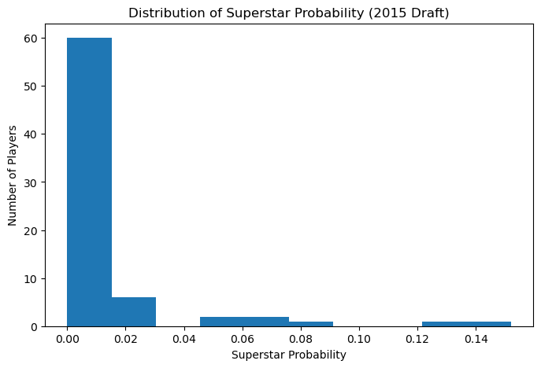
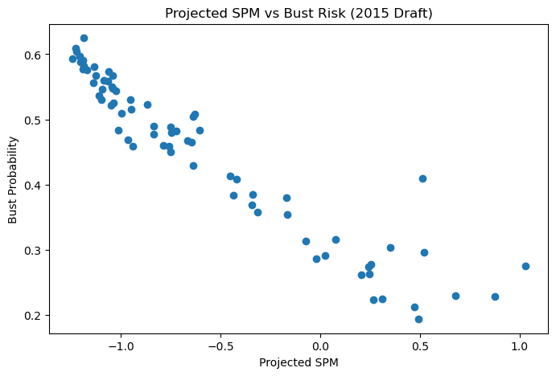
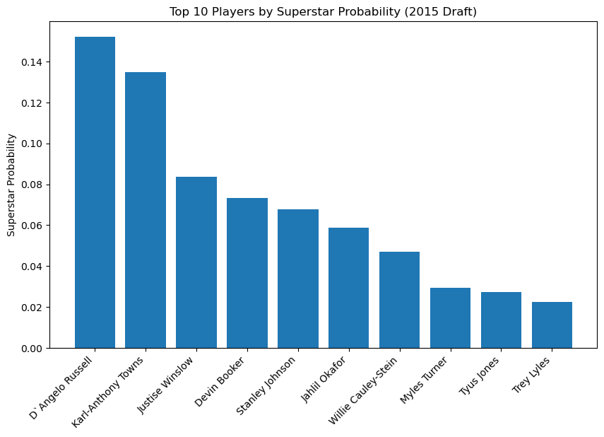

# The 2015 NBA Draft: Risk and Reward

The NBA Draft is an annual event where teams hope to find players who will become future superstars for their franchise. Teams invest millions of dollars based not on what players have done, but on what analysts believe they *might* become. Sometimes raw talent and potential can outweigh proven stats for a player. Using projection data from the 2015 NBA Draft, this analysis explores how players were expected to perform — and how uncertainty was built into those expectations.

## A Draft Full of Uncertainty

The first visualization shows the distribution of superstar probabilities for players in the 2015 draft. Most players cluster at the low end, with only a small number projected to have a high chance of becoming superstars. This highlights how rare elite outcomes are, even among top draft prospects. Rather than predicting stars confidently, the model spreads risk across uncertainty.

## High Expectations, High Risk

Projected SPM is often viewed as a summary of a player’s expected impact. However, when compared to bust probability, a more complicated picture emerges. Several players with respectable projected SPM values also carry significant bust risk. This suggests that upside and risk were often intertwined, forcing teams to gamble on players who could either succeed greatly or fail entirely. Even the players expected to turn out the best carry a significant risk with them. This shows you can never be 100% sure even with the brightest prospects. 

## Who Was Supposed to Be the Next Superstar?

Only a handful of players in the 2015 draft stood out with notably higher superstar probabilities. These players were seen as safer bets compared to the rest of the class. However, even the highest probabilities fall far short of certainty, underscoring how speculative draft forecasting truly is. The data suggests that even the “best” projections leave plenty of room for error. Whether these players truly suceeded is up to each persons' interpretations. A lot of these names still play at a high level today, and others don't

## Why This Matters

Draft decisions shape franchises for years. By examining how uncertainty is baked into projection models, we can better understand why teams sometimes miss — and why those misses may be inevitable. Rather than failures of scouting, these projections reveal a system that acknowledges risk, even if fans and teams often forget it.